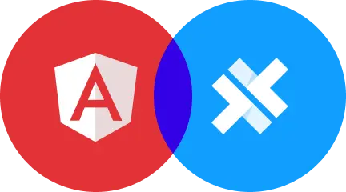
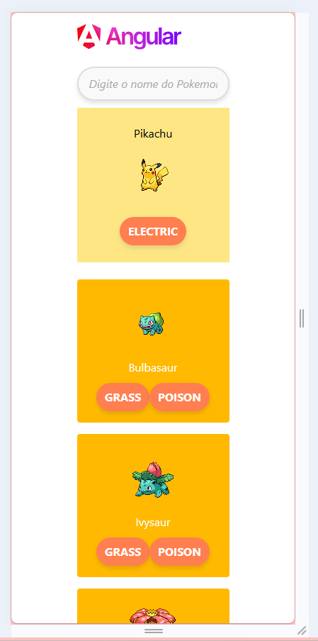
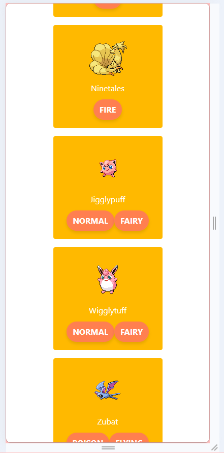
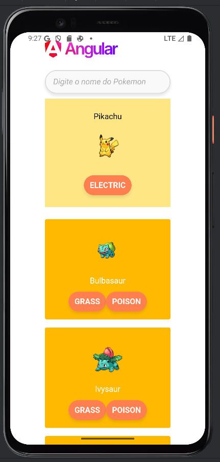
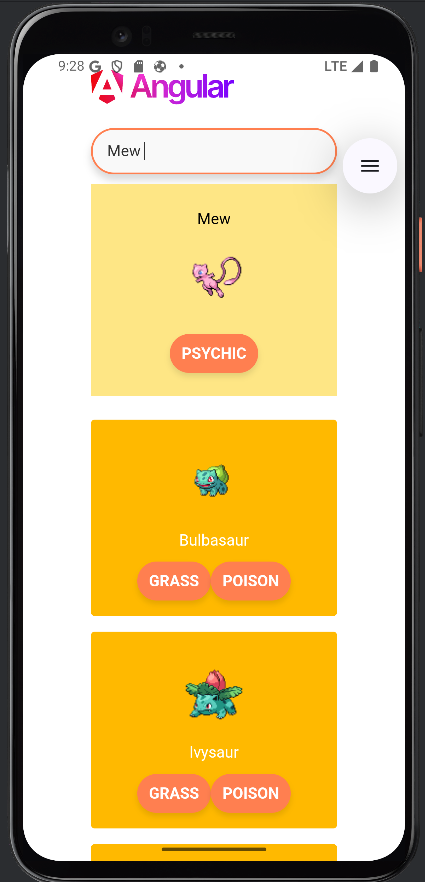

<div align="center">

</div>

# 🦅 Projeto Angular Pokémon

Uma aplicação moderna e de alto desempenho desenvolvida com **Angular 21** para explorar dados da [PokeAPI](https://pokeapi.co/) com busca reativa . O projeto agora conta com suporte nativo para dispositivos móveis via **Capacitor**.

---

## 🚀 Tecnologias e Inovações

### Core & Framework
- **Angular 21**: Utilizando as últimas funcionalidades do framework, incluindo Standalone Components, Signals e o novo Control Flow (`@for`, `@if`).
- **RxJS**: Gerenciamento de fluxos de dados complexos e busca reativa com `debounceTime(500)` e `switchMap` para evitar race conditions.
- **Capacitor 8**: Transforma a web app em uma aplicação nativa para **Android** e **iOS** com uma única base de código.

### Estilização & UI
- **Tailwind CSS 4**: Utilizado para uma interface moderna, responsiva e com performance otimizada através do novo motor de estilização.
- **Design Premium**: Cards interativos, animações de brilho (glow effects) e transições suaves que garantem uma experiência de usuário superior.

### Desenvolvimento & Qualidade
- **Vitest**: Framework de testes ultra-rápido integrado para garantir a confiabilidade das regras de negócio.
- **TypeScript 5.9**: Tipagem estrita para maior segurança durante o desenvolvimento.

---

## ✨ Funcionalidades Principais

- **🔍 Busca Reativa Inteligente**: O sistema filtra pokémons em tempo real enquanto você digita.
- **⚡ Performance Otimizada**: Uso de `fetch` nativo e SSR (Server-Side Rendering) configurado.
- **📱 Mobile Ready**: Interface adaptável para qualquer tamanho de tela e pronta para build mobile.
- **🛡️ Robustez**: Tratamento completo de estados de carregamento e erros de busca (Ex: Pokémon não encontrado).

---

## 🛠️ Instalação e Execução

### Web (Desenvolvimento)
1. Instale as dependências:
   ```bash
   npm install
   ```
2. Inicie o servidor local:
   ```bash
   npm start
   ```
3. Acesse `http://localhost:4200/`.

### Mobile (Android)
Este projeto utiliza Capacitor para rodar nativamente.
1. Gere o build de produção:
   ```bash
   npm run build
   ```
2. Sincronize com o projeto Android:
   ```bash
   npx cap sync android
   ```
3. Abra ou execute o app:
   ```bash
   npx cap open android
   ```

---

## 🏗️ Estrutura do Projeto

O código segue padrões modernos de organização por responsabilidade:

```text
src/app/
 ├── card/         # Componentes de exibição e lógica visual dos cards
 ├── services/     # Lógica reativa e integração centralizada com a PokeAPI
 ├── models/       # Definição de Interfaces e Types estritos do domínio
 └── ...           # Configurações de roteamento e componentes core
```

---

## Preview

<div>


</div>

<div>


<div>


## 📦 Detalhes Técnicos (Configs)
- **App ID**: `com.davi.dev.pokemonangular`
- **Build Tool**: Angular Build (Vite-powered)
- **SSR**: Habilitado para SEO e performance de primeiro carregamento.

---
Desenvolvido com ❤️ por **Davi Gomes Florencio**.

